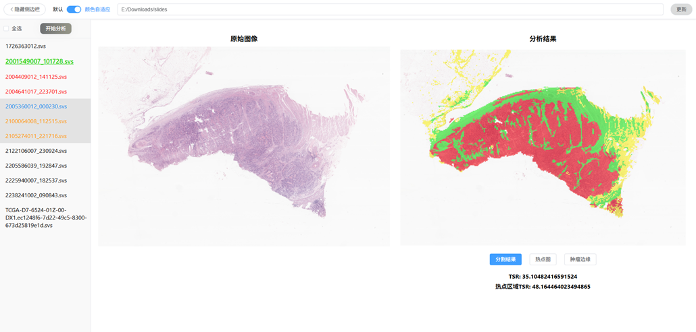

# 针对胃癌病理切片的肿瘤间质分析系统

## 功能

- 计算输入病理切片的肿瘤间质比
  - 全局肿瘤间质比
  - 热点区域肿瘤间质比
- 定位输入病理切片的肿瘤前缘

## 项目结构

### FrontEnd 前端分支

- 基于 Vue 开发
- 主界面为 `/src/App.vue`，包含多个子组件，见 `/src/components`
- `/Archive` 里是历史代码，已停止使用
- 界面展示：
  

### Backend 后端分支

1.  基于 NodeJs+Express 开发
2.  代码结构

    - `/routes` 路由文件夹
    - `/status` 存放 WSI 文件的分析状态，每个文件对应一个分析状态。只存储分析完成或分析失败这两类状态
    - `/public`
      - `/originImage` 存放提取出的 WSI 文件的最小分辨率原始图像
      - `/predictRes` 存放分析结果。每个 WSI 文件对应一个子文件夹，子文件夹命名规范为`WSI文件所在文件夹名称_WSI文件名_是否采用颜色归一化`。该子文件夹下的 json 文件记录了分析结果元信息，用于传给前端。其余文件都是分析结果。
    - `/bin` 启动文件夹，内部的`www`文件可以设置后端运行端口
    - `/algorithm` 算法模块所在文件夹
      - `/archive` 历史文件，已停止使用
      - `/dicts` 存放模型字典
      - `/fast-stain-normalization` Macenko 颜色归一化算法代码目录，是一个开源项目的。之所以引入这个是因为正常的 Macenko 库都是用 CPU 计算的，太慢了。这个开源项目实现了 GPU 运算
      - `/src` 源代码目录，每个文件的功能如文件名所示。子文件夹`/model`是分类模型 ResNet50 相关代码。

3.  功能
    > 接受前端请求，转发给算法模块进行运算。可以在路由里看到执行 python 指令的语句

### SURE 分支

- 用于训练分类模型的代码，上面后端用的算法模块里的模型字典就是用这些代码训练所得的。用的训练方法为论文《SURE: SUrvey REcipes for Building Reliable and Robust Deep Networks》的方法
- 训练数据见我的那个毕业论文
